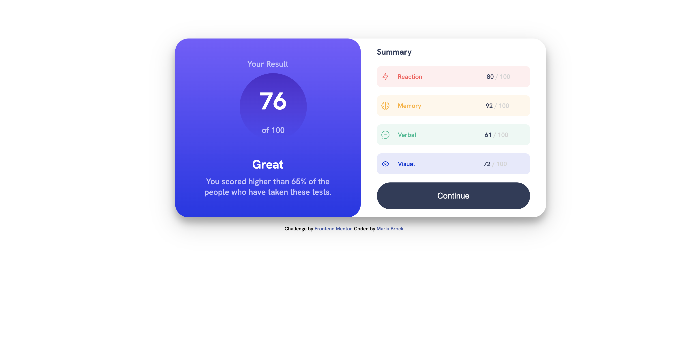
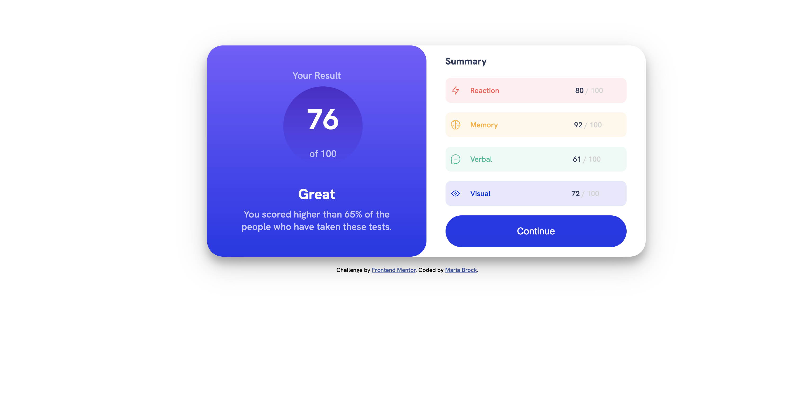
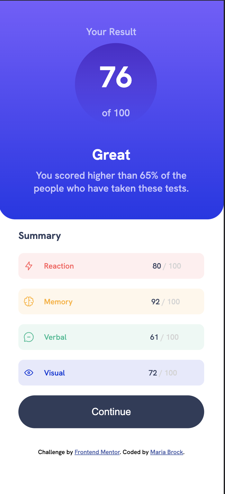

# Frontend Mentor - Results summary component solution

This is a solution to the [Results summary component challenge on Frontend Mentor](https://www.frontendmentor.io/challenges/results-summary-component-CE_K6s0maV). Frontend Mentor challenges help you improve your coding skills by building realistic projects. 

## Table of contents

- [Frontend Mentor - Results summary component solution](#frontend-mentor---results-summary-component-solution)
  - [Table of contents](#table-of-contents)
  - [Overview](#overview)
    - [The challenge](#the-challenge)
    - [Screenshot](#screenshot)
    - [Links](#links)
  - [My process](#my-process)
    - [Built with](#built-with)
    - [What I learned](#what-i-learned)
    - [Useful resources](#useful-resources)
  - [Author](#author)
  - [Acknowledgments](#acknowledgments)

## Overview

### The challenge

Users should be able to:

- View the optimal layout for the interface depending on their device's screen size
- See hover and focus states for all interactive elements on the page

### Screenshot





### Links

- Solution URL: [Github](https://github.com/mariabrock/frontendmentorio-results-summary)
- Live Site URL: [Github Pages](https://mariabrock.github.io/frontendmentorio-results-summary/)

## My process

### Built with

- Semantic HTML5 markup
- CSS custom properties
- Flexbox
- CSS Grid
- Mobile-first workflow
- Vanilla Javascript

### What I learned

```html
  <div class="summary-item" id="reaction">
    
    <p id="reaction-head">Reaction</p>
    <p>80 <span class="lowlight">/ 100</span></p>
  </div>
```
```css
.card {
  display: grid;
  grid-template-areas:
   "results summary";
  grid-template-columns: 1fr 1fr;
  grid-template-rows: 1fr;
  justify-items: center;
  justify-content: center;
  align-content: center;
  max-width: 50%;
  margin-left: 25rem;
  margin-top: 5rem;
  padding: 0;
  border-radius: 30px;
  background-color: hsl(0, 0%, 100%);
  box-shadow: 0 12px 16px 0 rgba(0,0,0,0.24), 0 17px 50px 0 rgba(0,0,0,0.19);
}
```

### Useful resources

- [Color Converter](https://www.rapidtables.com/convert/color/hsl-to-rgb.html) - Helped convert HSL to RGB for the background gradient.
- [Transparent Boxes CSS Demo](https://www.w3schools.com/cssref/tryit.php?filename=trycss3_opacity_box2) - W3 Schools demo illustrating transparent boxes.
[FreeCodeCamp Grid Tutorial/Cheat Sheet](https://www.freecodecamp.org/news/css-grid-tutorial-with-cheatsheet/) - Great walkthrough of the CSS Grid from FreeCodeCamp.

## Author

- Github - [@mariabrock](https://github.com/mariabrock)
- Frontend Mentor - [@mariabrock](https://www.frontendmentor.io/profile/mariabrock)
- LinkedIn - [@mariabrock](https://www.linkedin.com/in/maria-brock/)

## Acknowledgments
